### Hexlet tests and linter status:
               Игра Brain Games.

Игра  Brain Games, представляющая собой консольное приложение linux, предназначена для проверки знаний по разделам математики, посвящённым
таким темам как: чётность целых чисел, простые и составные целые числа, наибольший общий делитель,
вычисление математических операций и арифметическая прогрессия, состоит из 5 частей, каждая из них запускается по отдельности.

               Игра "Проверка на чётность" (brain-even).

Для запуска игры в консоли необходимо набрать команду bin/brain-even и нажати Enter. Ввести своё имя
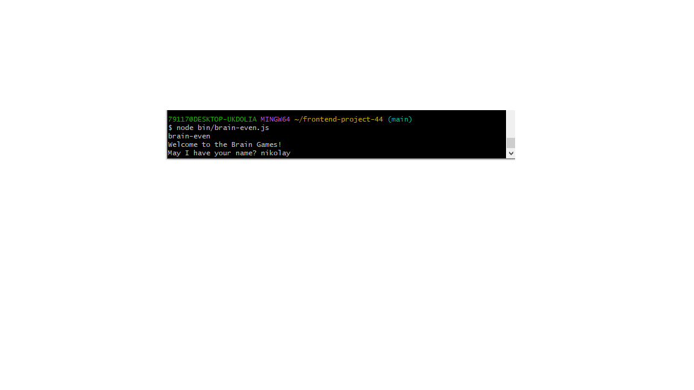
и ответить правильно на 3 вопроса, где
на консоль выдятся случайные целые числа и игрок должен правильно ответить чётное или нечётное это число набрав ответ в консоли: "yes" или "no", любой другой
ввод считается некорректным и гра прерывается, также игра прерывается, в случае если игрок введёт неправильный ответ. 
Пример, правильного ответа: 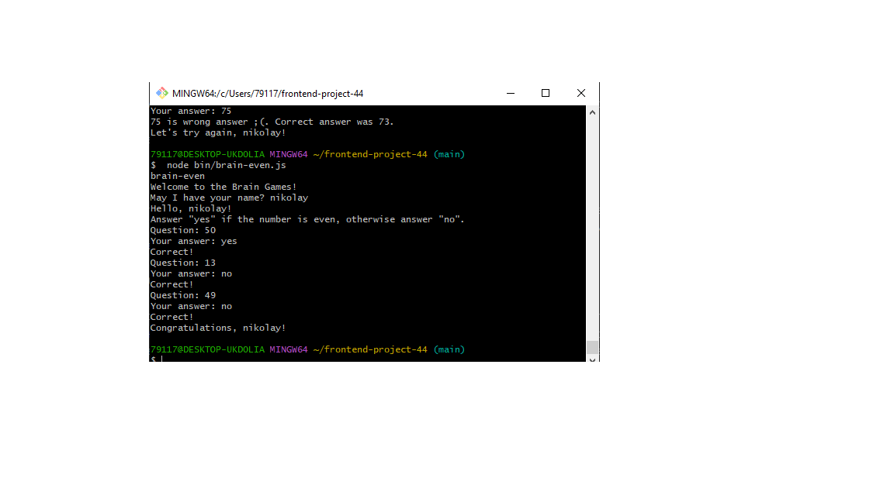
Пример, неправильного ответа: 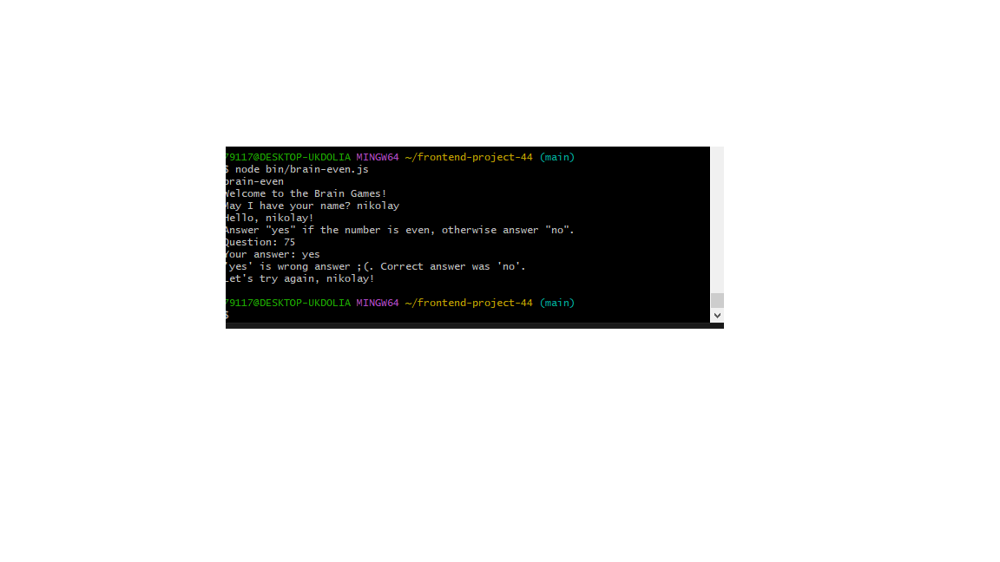

                Игра "Простое ли число?" (brain-prime).

Для запуска игры в консоли необходимо набрать команду bin/brain-prime и нажати Enter. Ввести своё имя и ответить правильно на 3 вопроса, где
на консоль выдятся случайные целые числа и игрок должен правильно ответить простое ли это число набрав ответ в консоли: "yes" или "no", любой другой
ввод считается некорректным и игра прерывается, также игра прерывается, в случае если игрок введёт неправильный ответ. 
Пример, правильного ответа: 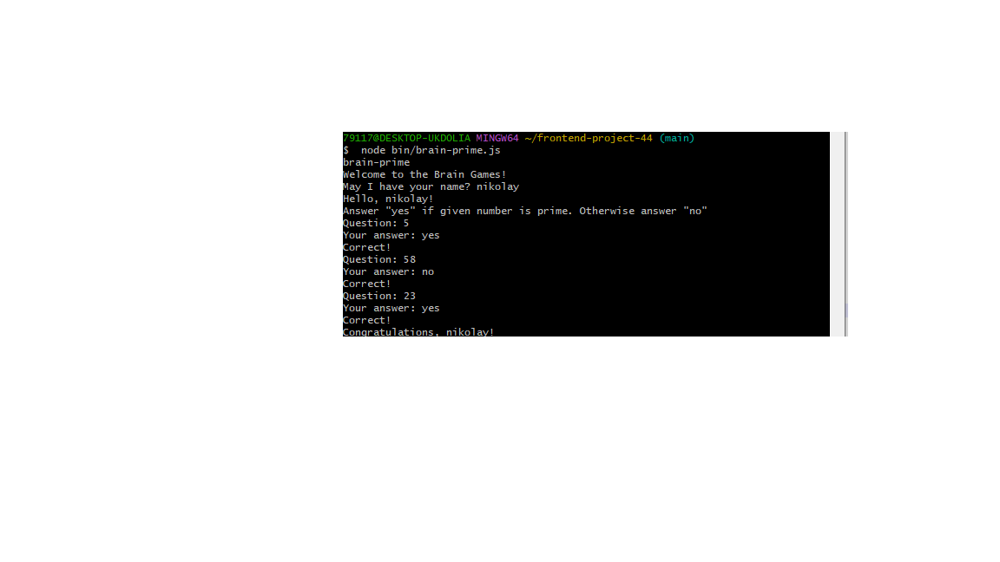
Пример, неправильного ответа: 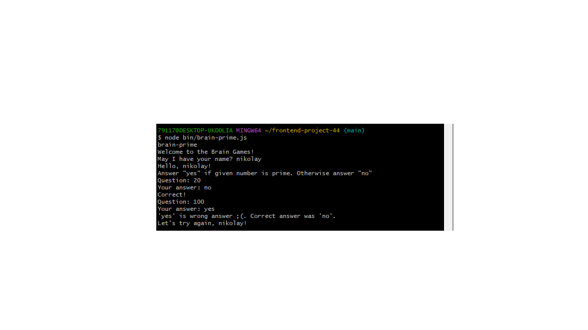

                Игра "НОД (наибольший общий делитель)" (brain-gcd).

Для запуска игры в консоли необходимо набрать команду bin/brain-gcd и нажати Enter. Ввести своё имя и ответить правильно на 3 вопроса, где
на консоль выдятся 2 случайных целых числа и игрок должен правильно ответить, какой у них наибольших общий делитель и набрать его в консоли, в случае 
если ответ неправильный или не корректный ввод (вместо числа пользователь ввел букву или какой-небудь другой символ) игра прерывается. 
Пример, правильного ответа: 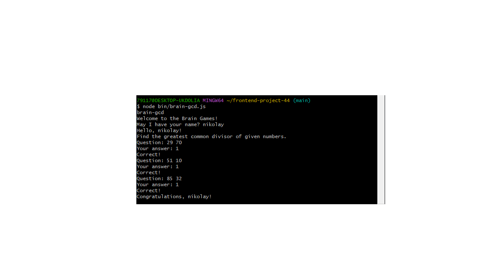
Пример, неправильного ответа: 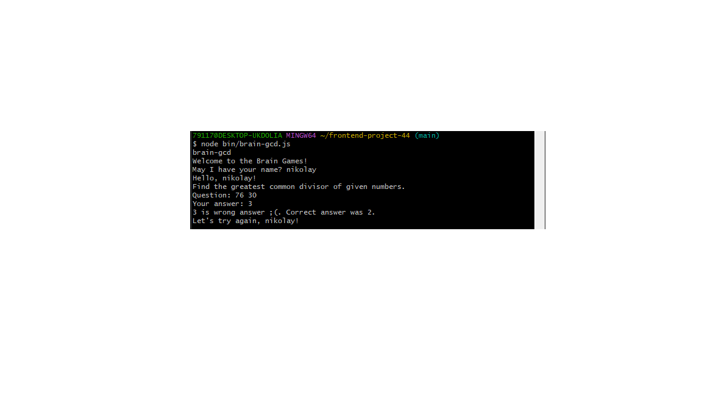     

                Игра "Калькулятор" (brain-calc).

Для запуска игры в консоли необходимо набрать команду bin/brain-calc и нажати Enter. Ввести своё имя и ответить правильно на 3 вопроса, где
на консоль выдятся 2 случайных целых числа и арифметическая операция (сложение, вычитание, умножение, деление) между ними выбранная также случайным образом.
Игрок должен правильно ответить чему равно данное выражение, в случае если ответ неправильный или не корректный ввод (вместо числа пользователь ввел букву 
или какой-небудь другой символ) игра прерывается.
Пример, правильного ответа: 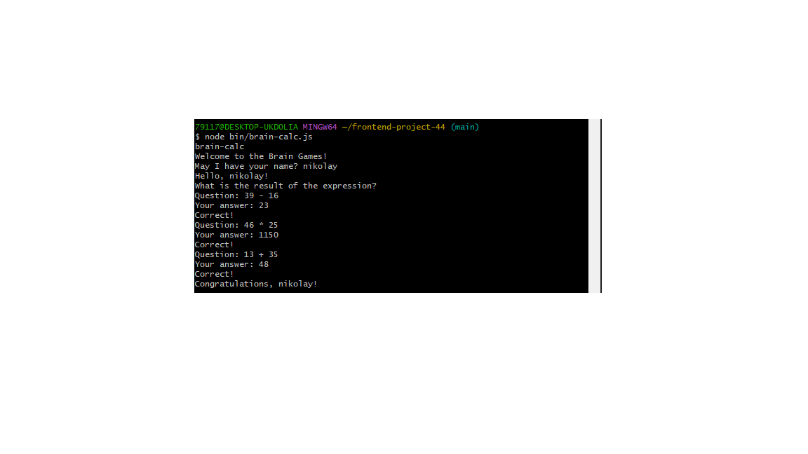
Пример, неправильного ответа: 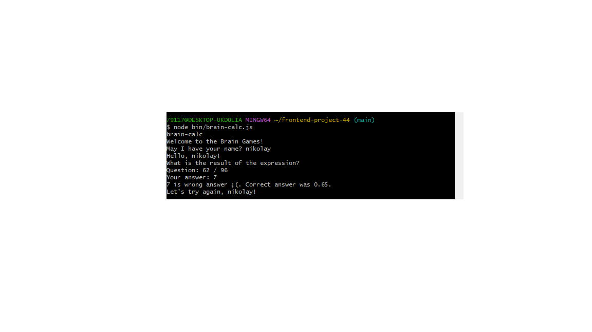        

                Игра "Арифметическая прогрессия" (brain-progression).

Для запуска игры в консоли необходимо набрать команду bin/brain-progression и нажати Enter. Ввести своё имя и ответить правильно на 3 вопроса, где
на консоль выдятся последовательность случайных целых чисел ввиде арифметической прогрессии, в которой находится спратанный элемент ввиде "..".
Игрок должен правильно ответить чему равен спрятанный элемент арифметической прогрессии, в случае если ответ неправильный или не корректный ввод 
(вместо числа пользователь ввел букву или какой-небудь другой символ) игра прерывается. 
Пример, правильного ответа: 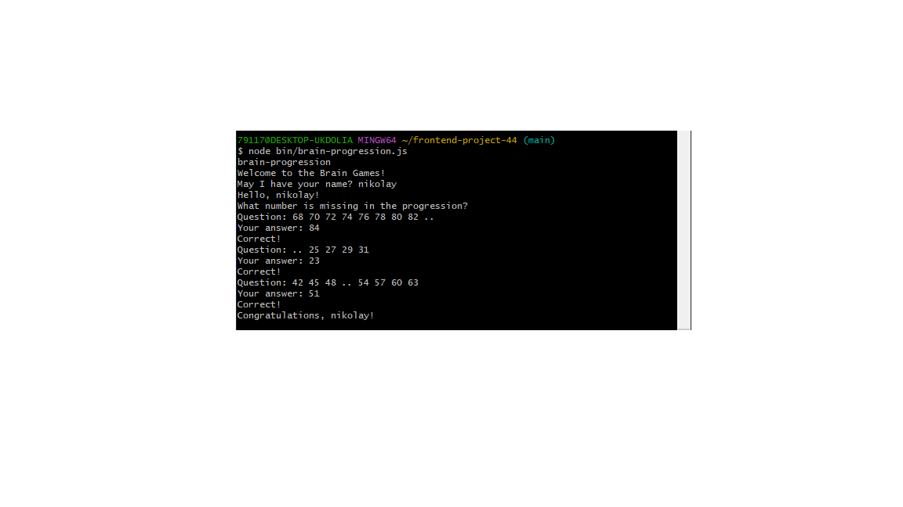
Пример, неправильного ответа: 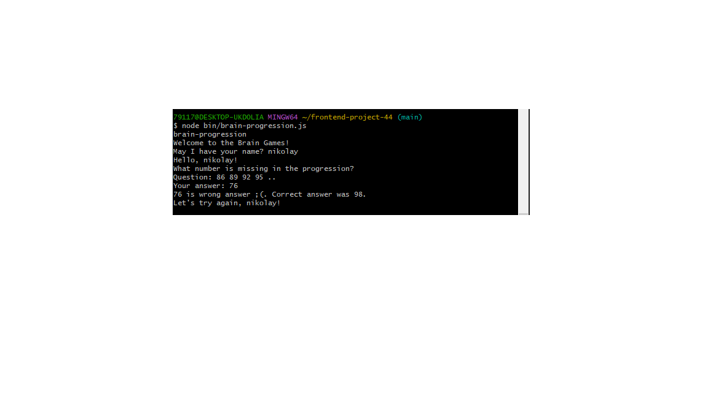       

